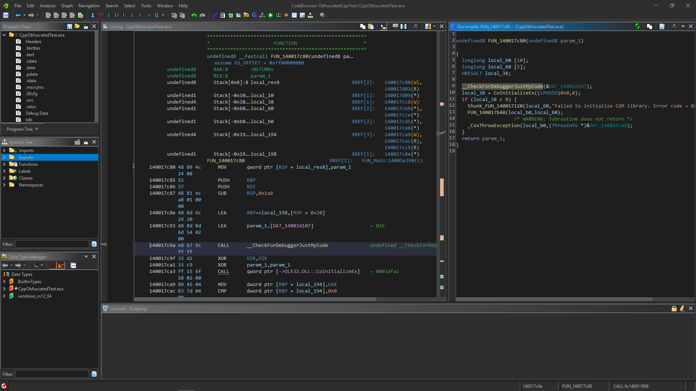

An Visual Studio-like dark theme for Ghidra.
============================================

From newbie to newbie. For everyone who is used to the dark theme of Visual Studio. As I am new to Ghidra, some colors may not be optimal and will likely change in the future.

How to install
--------------

1. Download this repository (`ghidra-vs-like-dark-v1.theme` file to be more precise);
2. From the **main** Ghidra window go to `Edit -> Theme -> Import...` and select `ghidra-vs-like-dark-v1.theme` file.

How to change
-------------

I collect important to me Visual Studio's values in `color.palette.vs...` collection so you can easily change these values if its differ in your theme. `color.palette.vs.blue` and `color.palette.vs.magneta` is a primary colors for Visual Studio 2019 and 2022 respectively.

You can edit colors directly in the code browser in `Edit -> Tool Options`: `Decompiler -> Display` and `Graph -> Listing Display`. Then you can export new theme from the **main** Ghidra window: `Edit -> Theme -> Export...`.

Example
-------

